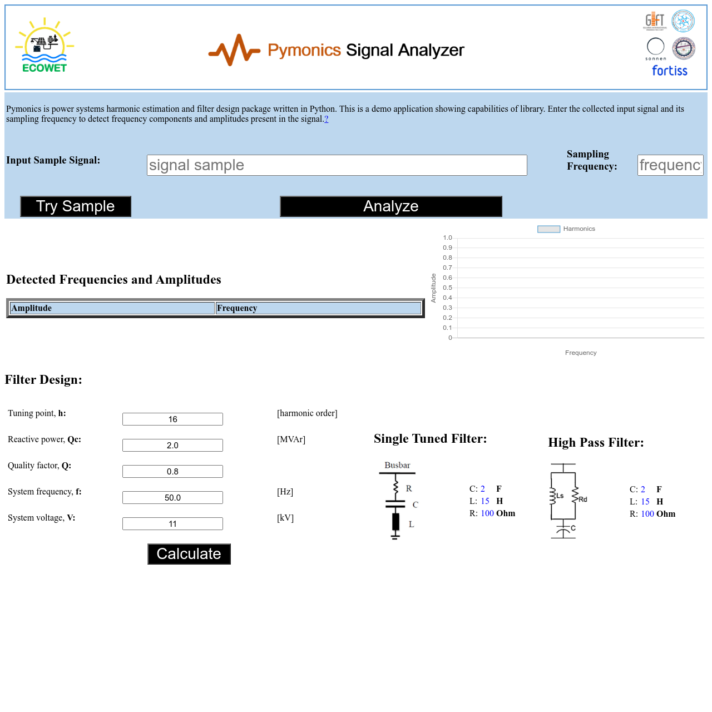

# Pymonics
# About the Tool
A Powersystems harmonic estimation and filter design package for Python. Package uses powerful algorithms based on memo and eprit techniques for estimating frequencies and is superior to conventional FFT algorithms.

This tool could be used to:
- detect frequencies and amplitudes including harmonic frequencies
- Generate sampling virtual signals of desired frequency components and amplitudes with desired length
- Perform basic filter designing

# Citing Pymonics
If you find our tool useful and would like to cite it in your publications, please refer following paper:
```
A. K. Srivastava, A. N. Tiwari, S. N. Singh, V. Pampana and M. Duchon, 
"Harmonic Frequency Estimation with MEMO-ESPRIT Technique using MATLAB and Python," 
2020 IEEE 7th Uttar Pradesh Section International Conference on Electrical, Electronics 
and Computer Engineering (UPCON), 2020, pp. 1-4, doi: 10.1109/UPCON50219.2020.9376423.
```

Package can be installed using pip

```
pip install pymonics
```
# sample usage
```
import pymonics as pymo
#harmonic detection
#sampling signal as comma seperated string
inputSignal="1.555037203,1.408682404,1.082233181,0.800207957,0.68369491,0.669075001,0.626269039,0.516688558,0.403207051,0.32593037,0.226662369,0.02752239,-0.23786631,-0.425827785,-0.434851784,-0.330624657,-0.286440107,-0.393009988,-0.565884313,-0.652380118,-0.62091771,-0.599285288,-0.723515083,-0.972306758,-1.185895815,-1.237604966,-1.152048425,-1.045787057,-0.976343471,-0.895748015,-0.755329073,-0.606094362,-0.547208786,-0.579369831,-0.552332151,-0.308300275,0.134551249,0.566568683,0.777677856,0.747239629,0.634025446,0.595036218,0.643717335,0.696930238,0.718325483,0.762929714,0.877111546,0.996786666,0.998136748,0.850380192,0.678593153,0.64102342,0.751509957,0.863869322,0.836777927,0.689177551,0.568594774,0.564496351,0.596027945,0.503058208,0.230365871,-0.114907136,-0.386543255,-0.548064341,-0.671099495,-0.804653648,-0.900537511,-0.893900161,-0.828523561,-0.847721489,-1.031617924,-1.272737982,-1.354205729,-1.164347866,-0.815484645,-0.531944524,-0.43703049,-0.471446189,-0.504199386,-0.490869186,-0.480268721,-0.495166129,-0.464007064,-0.300599853,-0.038953861,0.171294752,0.222427226,0.176573718,0.205229371,0.398144334,0.663360571,0.838150013,0.875439428,0.890530507,1.012805335,1.224348103,1.374892182,1.348988106,1.181906187,0.994380415,0.847182486,0.696014685,0.499051093,0.317750952,0.260822628,0.331893091,0.377461178,0.225225165,-0.120725406,-0.465225308,-0.605191029,-0.521875814,-0.374763192,-0.321919483,-0.380608319,-0.473065077,-0.563345426,-0.700625988,-0.918207163,-1.134403771,-1.211020962,-1.108860508,-0.953186956,-0.904834082,-0.984597441,-1.047760863,-0.952794001,-0.721303776,-0.506081684,-0.407975394,-0.361829281"
               
print(harmonicDetectAlogorithm.frequency_detection_byString(2400,inputSignal))
```
Detailed Example tutorial coming soon...


Feel free to try our sample web application based on python flask library. for live demo of this app visit: https://ecowet.venkateshpampan.repl.co 



If you would like to contribute in this project, feel free to send us your expression of interest or create a pull request.
